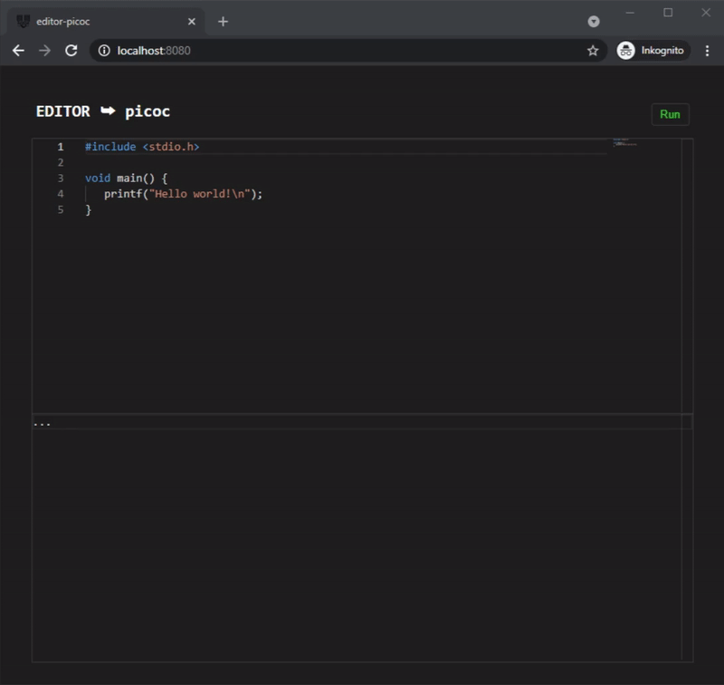

# editor-picoc

This is an online **C-editor** that uses a **client-side compiler (picoc)**.  
  
[Demo](https://editor-picoc.glitch.me/)  
  
  
  
I am using some well-known frameworks such as *emscripten*, [picoc-js](https://www.npmjs.com/package/picoc-js) or [monaco-editor](https://microsoft.github.io/monaco-editor/) in this project.  
Because it is small and suitable for our requirements, we opted for the [picoc](https://gitlab.com/zsaleeba/picoc) interpreter from *Zik Saleeba*. Special thanks to *Krithik Rao* for recompiling *picoc* to WASM.  
Feel free to customize the interpreters or programming languages that have been used.

## installation

Install [node.js](https://nodejs.org) and download all [dependencies](package.json).  
  
```
npm install
npm start
```
